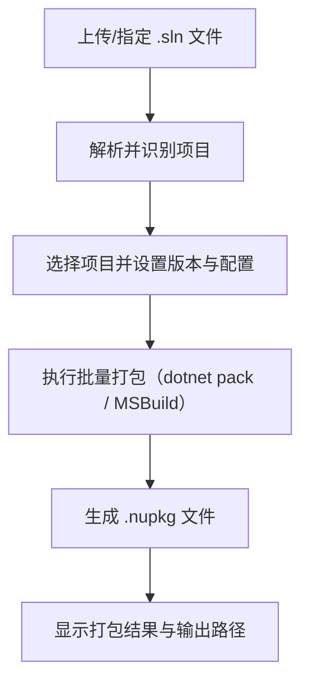
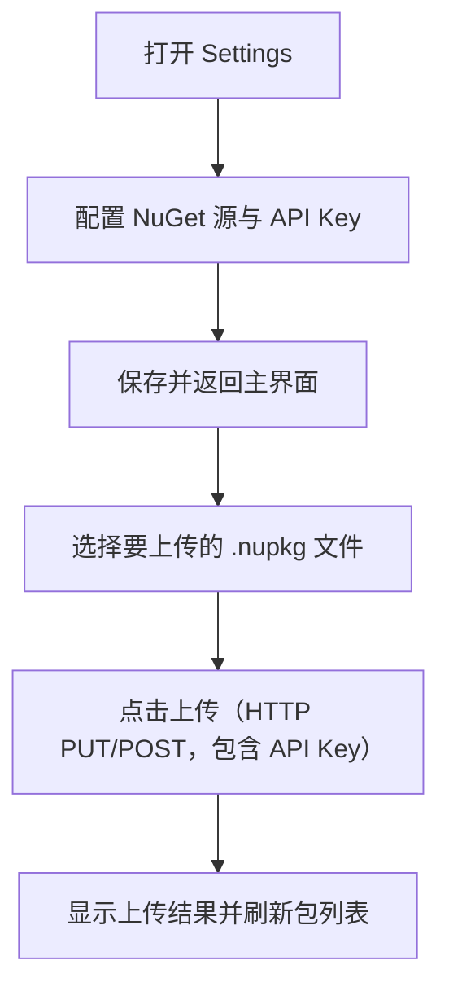
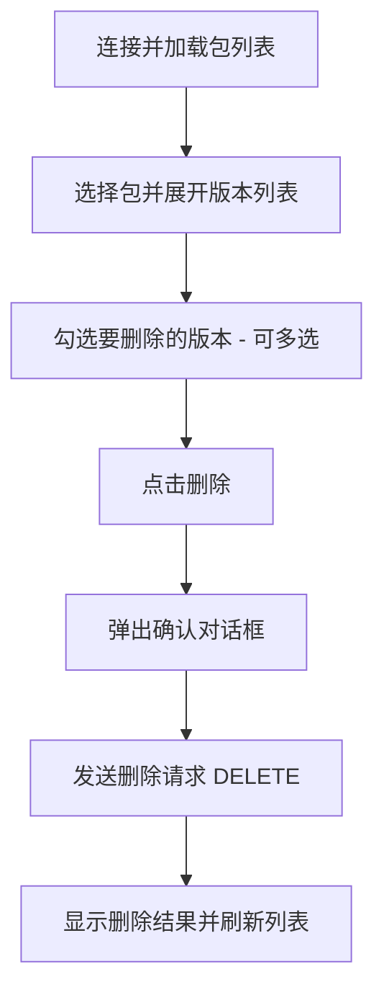

# NugetManagerGUI
私有化的 NuGet 包管理图形界面工具，用于简化 NuGet 包的管理和操作。

## 功能
- 支持根据解决方案识别项目并批量打包。
- 支持自定义 NuGet 源与 api-key
- 支持浏览私有 NuGet 包源内的包，并进行上传和删除操作

## 技术栈
- .NET 10 (WPF)
- CommunityToolkit.Mvvm (MVVM 架构)
- HandyControl (UI 组件与主题)

### 如何运行
- 打开解决方案并还原 NuGet 包（HandyControl、CommunityToolkit.Mvvm）。
- 使用 Visual Studio 2022/2026 打开并运行。

## 开发路径
### P0
- 支持上传解决方案文件，识别项目并显示
- 支持批量打包项目，并定义版本

### P1
- 点击 Settings 按钮打开配置界面
- 支持配置当前 NuGet 源与 api-key，并持久化保存，下次启动直接读取
- 支持浏览私有 NuGet 包源内的包列表，包含包名称以及所有版本

### P2
- 支持上传打包好的 NuGet 包到私有源
- 支持删除私有源内的指定版本的 NuGet 包，支持批量选择版本删除

## 如何使用
### 打包流程

简要步骤：
1. 在主界面上传或指定解决方案文件（`.sln`）。
2. 程序解析并列出可用项目，选择需要打包的项目并设置版本/配置。
3. 启动批量打包，等待完成。
4. 查看生成的 `.nupkg` 文件与日志输出。

### 上传流程

简要步骤：
1. 在 `Settings` 中配置私有源地址与 API Key，并保存。
2. 在上传界面选择一个或多个 `.nupkg` 文件。
3. 点击上传，程序向配置的私有源发送上传请求。
4. 查看上传结果，成功后在包浏览中刷新已上传的版本。

### 删除流程

简要步骤：
1. 在包浏览页面连接私有源并加载包列表。
2. 选择目标包并展开所有版本，勾选需要删除的版本。
3. 点击删除并在确认框中确认操作。
4. 程序发送删除请求，完成后刷新列表并提示结果。

注意：
- 删除操作通常不可恢复，操作前请确认并备份重要包。
- 出现网络或权限错误时，请检查 NuGet 源地址、API Key 以及网络连通性。
